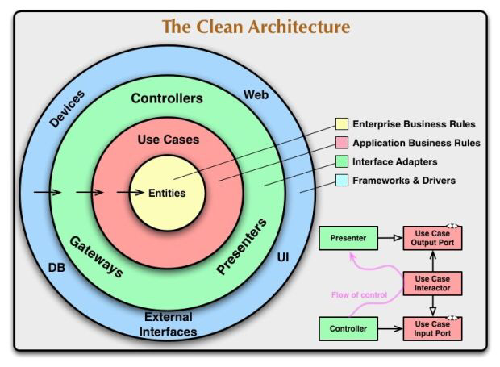
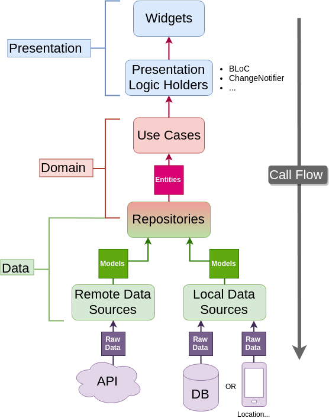

<div id="top"></div>

<!-- PROJECT LOGO -->
<br />
<div align="center">
  <a href="https://github.com/ajvelo/Flutter-News">
    
  </a>

  <h3 align="center">Clean Architecture</h3>

  <p align="center">
    How to implement clean architecture in a large-scale production application.
    <br />
    <a href="https://github.com/ajvelo/Flutter-News"><strong>Explore the docs »</strong></a>
    <br />
    <br />
    <a href="https://github.com/ajvelo/Flutter-News">View Demo</a>
    ·
    <a href="https://github.com/ajvelo/Flutter-News/issues">Report Bug</a>
    ·
    <a href="https://github.com/ajvelo/Flutter-News/issues">Request Feature</a>
  </p>
</div>


<!-- TABLE OF CONTENTS -->
<details>
  <summary>Table of Contents</summary>
  <ol>
    <li>
      <a href="#about-the-project">About The Project</a>
      <ul>
        <li><a href="#clean-architecture">Clean Architecture</a></li>
        <li><a href="#clean-architecture-for-flutter">Clean Architecture for Flutter</a></li>
        <li><a href="#file-structure">File Structure</a></li>
      </ul>
    </li>
    <li>
      <a href="#layers">Getting Started</a>
      <ul>
        <li><a href="#domain">Domain</a></li>
        <li><a href="#data">Data</a></li>
        <li><a href="#presentation">Presentation</a></li>
      </ul>
    </li>
    <li>
      <a href="#testing">Testing</a>
      <ul>
        <li><a href="#unit-testing">Unit Testing</a></li>
      </ul>
    </li>
  </ol>
</details>

## About The Project

Deciding on architecture is likely the most important part of your application. It can make your code incredibly easy to work with or can be a nightmare for implementing features. When deciding upon an architecture to use, it’s important to take into account the following:

* Independent of Frameworks. The architecture does not depend on the existence of some library of feature-laden software. This allows you to use such frameworks as tools, rather than having to cram your system into their limited constraints.

* Testable. The business rules can be tested without the UI, Database, Web Server, or any other external element.

* Independent of UI. The UI can change easily, without changing the rest of the system. A Web UI could be replaced with a console UI, for example, without changing the business rules.

* Independent of Database. You can swap out Oracle or SQL Server, for Mongo, BigTable, CouchDB, or something else. Your business rules are not bound to the database.

* Independent of any external agency. In fact, your business rules simply don’t know anything at all about the outside world.

Now that we know from the points above what makes for a good architecture we can deduce there are two key factors that are crucial for the implementation of clean code. The first is that it must be stand-alone, meaning it does not rely on any internal or external dependencies. The second is that its components must testable. In fact, the several points above come from _Robert C. Martin_, who founded the principles of <strong>Clean Architecture</strong> with these points in mind. It is these principles that we’ll use as the foundation for our Flutter news application.


### Clean Architecture

The clean architecture cannot be applied to Flutter directly and nor should it. It was created before Flutter even came into existence. We can, however, use its model to inform us as to what clean code should look like and how our application should be structured. The reason for using this particular model is that at its core it uses common, fundamental programming and design principles such as SOLID, DRY and SSOT.

<br />
<div align="center">
    
  </a>
</div>
<br />

From the diagram, you can see that everything stems from the <strong>entity.</strong> These are, according to its creator, the enterprise business rules, or another way of putting it is they are the business objects contained in our application. These entities should be high-level and (ideally) should never change. They should remain the same when things such as page navigation, security and styling are implemented.

The use cases are application-specific business rules, meaning they are meant to describe and cover all the features within our application. They dictate the flow of data from the entities to the presentation layer. Changes to the use cases should not affect the entities, as they are within a separate layer and therefore independent. In fact, any changes to any of the external layers should not affect the use cases since it is completely isolated. 

The green layer, which is essentially the presentation layer serves to transform the use cases into UI, the blue outer layer. The presentation layer where the state management of our application will take place and is the most flexible out of the 4 layers. It can be easily swapped out for another state management implementation and most importantly, should not affect the other layers. State management libraries are plentiful and there is no one that is better than the other, but in the application, we’ll use BLoC for its ease of use as well as its wide adoption within the Flutter community for reasons explained later on.

### Clean Architecture for Flutter

It’s now time to use the architectural diagram above and adjust it to meet Flutter's needs. Thankfully, there’s not too much adjusting to do since we have already established our call flow. Our call flow is what defines how our layers should talk to each other and the direction that communication should flow. Since we have our call flow and know the layers needed for our application we can create a diagram to show how our architecture should look like.

<br />
<div align="center">
    
  </a>
</div>
<br />

It should be noted that this diagram is in fact so common within the Flutter community that there’s even a package for it! Nothing new was created or adjusted for the purpose of this project as it works perfectly well as it is.

The Flutter Clean Architecture diagram is pretty self-explanatory for the most part, but you might have noticed that the repositories sit in both the data and domain layer. Repositories are essentially classes that utilise models and return entities to give to the use cases to be transformed into UI. With this definition in mind, it makes sense that both the data and domain layer should have an understanding of the repository, although we still want to ensure a separation of concerns between the layers and make certain that both have single responsibilities. This is where abstractions and implementations come into play. Let’s take a look at the definition:

</br>

>An abstract class, which is similar to an interface, defines a class that cannot be instantiated. Abstract classes keep your code honest and type safe. It ensures that all implementation subclasses define all the properties and methods that the abstract class defines, but leaves the implementation to each subclass.
>
> -- Flutter by Example

</br>

What we are achieving by having the repository sit in both the data and domain layer is we are essentially defining a contract between them.

### File Structure

File structures will always differ slightly depending on the project. The important thing is to ensure that the data, domain and presentation layers are divided into their separate folders, with their constituent components within, in order to conform with our clean architecture. Another important factor to mention here is it would be beneficial to replicate this structure for each feature, in order to avoid the different folder layers becoming too large and cluttered. The file structure within this project is modelled on the template below:

```
├──lib/
│  ├──core/
│  ├──features/
│     └──feature_name/
│       ├──data/
│         ├──datasources/
│         ├──models/
│         └──repositories/
│       ├──domain/
│         ├──entities/
│         ├──usecases/
│         └──repositories/
│       ├──presentation/
│         ├──bloc/
│         ├──pages/
│         └──widgets/
│  └──main.dart
```

As seen from the example, all the .dart files located within the architectural folders sit inside the lib folder, where `main.dart` is the point of entry for the application. The tests could allow being structured like this as well, in order to mirror the logic being implemented. A core folder could be added on the same level as the feature folders to contain useful helper files that the features may have in common.

## Layers

### Domain

The domain layer has 3 key components and sits in between the presentation and data layer.

* Entities
* Use cases
* Repository (As a contract)

#### Entities
The entity is the data the application will interact with. Its properties can be constructed from the data retrieved from the data sources and applying the relevant fields. An important thing to mention here is that the class should extend Equatable for easy value comparisons.

#### Use cases
As mentioned before, use cases are application-specific business rules. They get their data from the repository. Calls to repositories are generally asynchronous (especially if calling an API). We would therefore expect our use cases to return a Future. The future can be _either_ the object being returned or an error. With that in mind, we could extend our use case to allow for error handling, perhaps instead of returning a future of our type we return <stong>either</strong> an error or our Type. Such functionality is possible with functional programming and can be accomplished with the dartz package.

#### Repository (As a contract)
We know that the repository sits in both the data and domain layers. To be more precise, the contract is with the domain while the implementation is with the data layer. Since we’re using dart, this will be done via an `abstract` class.

### Data

The data layer is as you guessed where data is exchanged between the different modules. These modules generally come in the form of servers and databases but can also include services such as 3rd party libraries. It’s the lowest level of the three layers and also consists of 3 components

* Models
* Datasources
* Repositories (Implementation)

#### Models
Models are similar to the domain’s entities except they have additional functionalities added to them, mainly the ability to serialise and deserialise to and from JSON. Since our APIs will return data in a JSON format, we need to ability to convert this into a custom object of our chosen type.

Conversion logic for serialisation and deserialisation can be placed either inside the model or in a separate mapper class. Both are perfectly valid solutions although some feel that conversion logic directly inside the model is sufficient and easier to work with.

To strengthen the relationship between our entities and models, our models should provide an extension to allow for the conversion into an entity (since that is what our repository will return). This is important as the only difference between the two should be one contains conversion logic to convert to and from JSON, which is used only in the data layer while the other does not and is used exclusively within the presentation layer. It is therefore important to seperate the responsibilities of these classes.

#### Repositories (Implementation)

Repositories are the brain of the data layer. They handle the retrieval of data from the data sources as well as choosing which one to use for a given purpose. We already have the contract thanks to the domain layer, so the data layer repository simply implements these methods.

#### Datasources

Repository implementations need to get their data from somewhere, so they are heavily reliant on their data sources. Data sources tend to come in form of remote and local, where remote will retrieve the data from an API and local will retrieve from the cache. Similar to the repository contract between the data and domain layer, we can create a similar abstraction for the data sources and implement them.

An important note here is that datasources do not return errors inline. Instead, they catch exceptions as soon as possible and throw them. That way, the repository implementation can have the responsibility of returning Failure objects from the methods. The second point is that we are returning models, not entities. The reason for these differences is that data sources are at the lowest level of implementation, they are at the border crossing between our own logic and those of APIs and 3rd party libraries.

### Presentation

Presentation layers serve as the presentation logic holders, as well as containing all the UI in the form of widgets. This is where state management happens. Whatever library you use for this approach is entirely down to you. `ChangeNotifier`, `BLoC` and `ViewModels` are all perfectly valid and common forms of state management. Some are easier to work with than others, and some require more low-level implementation. In this project, I'll be using BLoC as it was specifically designed with Flutter in mind and is incredibly easy to use.

#### BLoC

BLoC stands for Business Logic Component and its purpose (like all other state management approaches) is to make sure that presentation and business logic is kept separate and under the control of a state management layer. BLoC does this by ensuring data only flows in one direction. There are three key steps to the BLoC process:

* Event Dispatch
* Interpretation
* State Emission 

Event Dispatch is where events are dispatched from widgets as a result of some wanted change in the UI. In our news application an example of this is selecting a category. This is then sent to the BLoC where the interpretation happens. The BLoC receives the event and in turn decides the relevant business logic to execute, which would be calling the use case. Once the BLoC has received a response from the domain layer, it emits a state to the widgets, telling the widgets they should update according to the newly received state.

## Testing

One of the key reasons why clean architecture for Flutter is so popular is because of its testability. As mentioned previously, the folder structure of your tests could mirror exactly the folder structure within your `/lib/` folder, so the logic can be tested function to function.

### Unit Testing

The goal of unit testing is to test a single function. Although in some cases you can also test an entire class. The idea is to verify the correctness of a unit of logic under a variety of conditions. External dependencies of the unit under test are generally mocked out. There are a number of libraries to help with this, but since the introduction of Null Safety in Flutter, I would recommend a package like Mocktail, which generates mocks for you without the need to create them yourself. 

<p align="right">(<a href="#top">back to top</a>)</p>